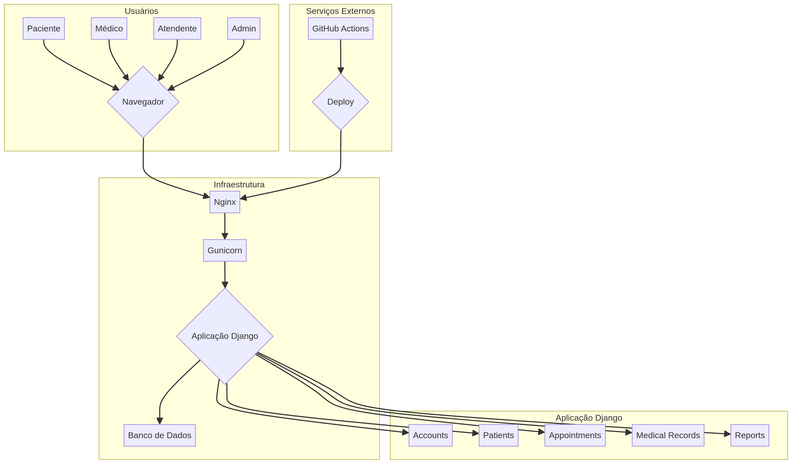

# Promptuario - Sistema de Prontuário Eletrônico


O **Promptuario** é um sistema web de prontuário eletrônico projetado para otimizar a gestão de informações de pacientes em unidades de saúde. Ele centraliza o histórico médico, agendamentos, receitas e outros dados clínicos, facilitando o acesso seguro para médicos, atendentes e pacientes.

## 🧾 Informações Gerais

- **Área de Aplicação:** Saúde
- **Público-alvo:** Unidades de saúde públicas, médicos, atendentes e pacientes.
- **Tipo de Sistema:** Aplicação Web

## 🏗️ Diagrama de Arquitetura

O diagrama abaixo ilustra a arquitetura geral do sistema, desde a interação do usuário até a infraestrutura de backend.



### 📄 Documentação do Projeto
- [Clique aqui para abrir a documentação](./docs/Promptuário.pdf)

## ✨ Funcionalidades Principais

O sistema é dividido nos seguintes módulos:

- **Gestão de Contas e Perfis:**
  - Autenticação segura com diferentes níveis de acesso (Admin, Médico, Atendente, Paciente).
  - Perfis detalhados para cada tipo de usuário.

- **Gestão de Pacientes:**
  - Cadastro completo de pacientes com informações pessoais e médicas.
  - Registro de alergias, vacinas e medicamentos de uso contínuo.

- **Agendamento de Consultas:**
  - Marcação de consultas e retornos.
  - Calendário de disponibilidade dos médicos.
  - Cancelamento de consultas com regras de negócio (24h de antecedência).

- **Prontuário Eletrônico:**
  - Histórico completo de todas as consultas e procedimentos.
  - Geração de receitas médicas em PDF.
  - Solicitação e registro de resultados de exames.

- **Administração do Sistema:**
  - Gerenciamento de usuários (médicos e atendentes).
  - Configuração de quadros de horários e plantões.

- **Relatórios:**
  - Geração de relatórios sobre consultas, pacientes e atividades médicas.

## 🛠️ Tecnologias Utilizadas

- **Backend:** Python 3.11, Django 4.2
- **Frontend:** Django Templates, CSS3, JavaScript
- **Banco de Dados:** SQLite (desenvolvimento), PostgreSQL (produção)
- **Testes:** Pytest, Pytest-Django, Coverage
- **Qualidade de Código:** Black, Flake8, iSort
- **Infraestrutura:** Docker, Docker Compose, Nginx
- **CI/CD:** GitHub Actions

## 🚀 Começando

Siga as instruções abaixo para configurar e executar o projeto em seu ambiente local.

### Pré-requisitos

- Python 3.11+
- Docker e Docker Compose (para execução com containers)

### 1. Instalação (sem Docker)

Clone o repositório e execute o script de setup, que irá configurar o ambiente virtual, instalar as dependências e preparar o banco de dados.

```bash
git clone https://github.com/seu-usuario/promptuario.git
cd promptuario

# Dê permissão de execução ao script
chmod +x setup.sh

# Execute o script de setup
./setup.sh
```

Após a conclusão, inicie o servidor de desenvolvimento:

```bash
source venv/bin/activate
python manage.py runserver
```

### 2. Instalação (com Docker)

Para uma configuração mais rápida e isolada, utilize o Docker Compose. Este método irá construir as imagens, iniciar os contêineres e executar as migrações automaticamente.

```bash
docker-compose up --build
```

A aplicação estará disponível em [http://localhost:8000](http://localhost:8000) (via `runserver`) ou [http://localhost](http://localhost) (via Docker).

## 🧪 Executando Testes

Para executar a suíte de testes e verificar a cobertura de código, utilize o Pytest:

```bash
source venv/bin/activate
pytest
```

## 👤 Usuários de Teste

O sistema é populado com os seguintes usuários para facilitar a demonstração:

| Usuário   | Senha        | Perfil        |
|-----------|--------------|---------------|
| `admin`     | `admin123`   | Administrador |
| `medico`    | `medico123`  | Médico        |
| `atendente` | `atendente123` | Atendente     |
| `paciente`  | `paciente123`| Paciente      |

## 🌐 Endpoints

- **/healthcheck**: Endpoint para verificação de status do sistema. Retorna `{"status": "ok"}` se a aplicação estiver no ar.

## 📂 Estrutura do Projeto

```
promptuario/
├── accounts/         # App de usuários, perfis e autenticação
├── appointments/     # App de agendamentos
├── medical_records/  # App de prontuários, receitas e exames
├── patients/         # App de pacientes, alergias e vacinas
├── reports/          # App de relatórios
├── config/           # Configurações centrais do Django
├── static/           # Arquivos estáticos (CSS, JS)
├── templates/        # Templates HTML
├── .github/          # Workflows de CI/CD
├── Dockerfile        # Configuração do container da aplicação
├── docker-compose.yml# Orquestração dos serviços
├── README.md         # Esta documentação
└── requirements.txt  # Dependências Python
```

## 🔄 CI/CD

O projeto utiliza GitHub Actions para integração e entrega contínua. O workflow (`.github/workflows/ci.yml`) automatiza:

1.  **Testes:** Executa a suíte de testes com Pytest em cada push ou pull request.
2.  **Linting:** Verifica a qualidade e o estilo do código com Black, Flake8 e iSort.
3.  **Build:** Gera a imagem Docker da aplicação quando há um push para a branch `main`.

## 🤝 Contribuição

Contribuições são bem-vindas! Para contribuir:

1.  Faça um fork do projeto.
2.  Crie uma nova branch (`git checkout -b feature/nova-funcionalidade`).
3.  Faça suas alterações e commit (`git commit -m 'Adiciona nova funcionalidade'`).
4.  Envie para a sua branch (`git push origin feature/nova-funcionalidade`).
5.  Abra um Pull Request.

## 📄 Licença

Este projeto está licenciado sob a Licença MIT. Veja o arquivo `LICENSE` para mais detalhes.
